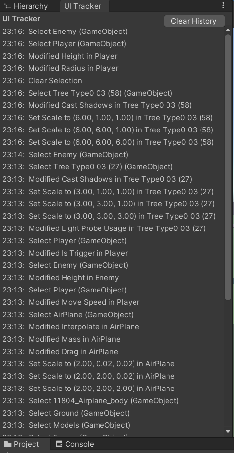
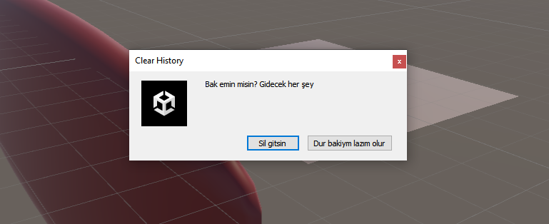

# Unity UI Tracker Window

The UI Tracker Window is a Unity Editor extension that tracks changes made to the Editor UI and displays them in a list. The window is useful for keeping track of changes made during a development session and helps with debugging and troubleshooting issues. The list is dynamic and limit can be changed from the script.

Window             |  Clear Button Check
:-----------------:|:-----------------:
|
## Installation
    Download script.
    Copy the UI_Tracker.cs script to your Unity project's Assets/Editor folder.
    Open the Unity Editor and select Window > UI Tracker from the menu to open the UI Tracker window.

## Usage
The UI Tracker window displays a list of the most recent changes made to the Unity Editor UI. The changes are listed in reverse chronological order, with the most recent change at the top.

To clear the list of changes, click the "Clear History" button at the top-right of the window. A confirmation dialog will appear to confirm the action.

The UI Tracker window only tracks changes made to the Unity Editor UI, such as changes to the scene hierarchy, object properties, and component settings. It does not track changes made to the game or application UI at runtime.

The UI Tracker window is intended for use during development and debugging. It is not recommended to leave the window open during a build or release of the game or application.
### TODO?
Applying material to the object is counted as change at that moment, I don't know why. Because of that I added current change description part.

### License
The UI Tracker Window script is licensed under the MIT license. Feel free to use, modify, and distribute the script as needed.
